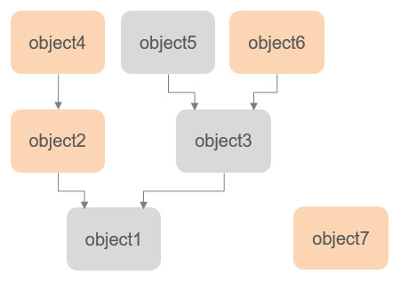

# Колекції

Колекція - це група [об'єктів сцени](<Scene objects/Scene objects.md>), що створена користувачем. Колекції, як і самі об'єкти, є [сутностями](index.md). Колекції стають у пригоді, коли при здійсненні деяких операцій необхідно звернутися до кількох об'єктів таких, як, наприклад, робот. Прикладом використання може бути [виявлення зіткнення](https://www.coppeliarobotics.com/helpFiles/en/collisionDetection.htm) між кількома роботами: якщо для перевірки була визначена пара (_колекціяРоботів1_; _колекціяРоботів2_), тоді алгоритм виявлення буде шукати будь-які перетини між об'єктами з першої колекції та об'єктами із другої.

Колекції - це сутності, які за визначенням можуть [стикатися](<Scene objects/Collidable objects.md>), [вимірюватись](<Scene objects/Measurable objects.md>) та [детектуватися](<Scene objects/Detectable objects.md>). Це означає, що колекції:

- можуть бути використані для [виявлення зіткнень](https://www.coppeliarobotics.com/helpFiles/en/collisionDetection.htm) з іншими об'єктами, здатними до зіткнень.
- можуть бути використані для [обчислення мінімальної відстані](https://www.coppeliarobotics.com/helpFiles/en/distanceCalculation.htm) з другими об'єктами, що вимірюються.
- можуть бути виявлені [сенсорами наближення](https://www.coppeliarobotics.com/helpFiles/en/proximitySensors.htm).

Те, що колекція здатна до стикання, вимірювання та детектування, ще не означає, що усі об'єкти у цій колекції мають ці три властивості:

- Під час виявлення зіткнень тільки підмножина об'єктів у колекції, що здатні до зіткнень, буде порівнюватись з іншим об'єктом, здатним до зіткнень.
- Під час обчислення відстані тільки підмножина об'єктів у колекції, що вимірюються, буде порівнюватись з іншим об'єктом, що вимірюється.
- Тільки підмножина об'єктів у колекції, що детектуються, може бути виявлена сенсорами наближення.

Тим не менш, колекція може перевизначати здатність своїх об'єктів до стикання, вимірювання та детектування.

Колекція складається з одного чи кількох елементів, які поєднуються за аддитивним чи субтрактивним методом. Підтримуються наступні види елементів:

- окремий об'єкт.
- дерево об'єктів: цей елемент представляє усіх нащадків деякого об'єкта, розташованого на верхівці дерева. Якщо дерево росте чи зменшується, елемент буде також відповідно змінюватись.
- ланцюг об'єктів: представляє усі об'єкти, що зустрічаються при прямуванні від початку ланцюга. Якщо ланцюг росте або зменшується, елемент буде також відповідно змінюватись.
- усі об'єкти сцени.

Колекція не статична і постійно моніториться та оновлюється у відповідь на зміни у її елементах. До того ж будь-яка колекція може бути визначена у кілька різних шляхів в залежності від потреб:

<p align="center">

</p>
<p align="center">[Приклад колекції з 4 елементами, що зафарбовані кольором]</p>

Колекція на попередньому зображенні складається з 4 елементів та може бути створена наступним кодом:

```
--lua
-- Collection defined as: <object2> + <object4> + <object6> + <object7>

local object2 = sim.getObject('/object2')
local object4 = sim.getObject('/object4')
local object6 = sim.getObject('/object6')
local object7 = sim.getObject('/object7')
collectionHandle = sim.createCollection(0)
sim.addItemToCollection(collectionHandle, sim.handle_single, object2, 0)
sim.addItemToCollection(collectionHandle, sim.handle_single, object4, 0)
sim.addItemToCollection(collectionHandle, sim.handle_single, object6, 0)
sim.addItemToCollection(collectionHandle, sim.handle_single, object7, 0)
```
Але схожа колекція може бути визначена інакше, як комбінація з 3 елементів _[різного типу]_:

```
--lua
-- Collection defined as: <all objects> - <tree starting at object1> + <object6>

local object1 = sim.getObject('/object1')
local object6 = sim.getObject('/object6')
collectionHandle = sim.createCollection(0)
sim.addItemToCollection(collectionHandle, sim.handle_all, -1, 0)
sim.addItemToCollection(collectionHandle, sim.handle_tree, object1, 1)
sim.addItemToCollection(collectionHandle, sim.handle_single, object6, 0)
```

Також варто переглянути розділ [API-функцій, пов'язаних з колекціями](https://www.coppeliarobotics.com/helpFiles/en/apiFunctions.htm#collections).
