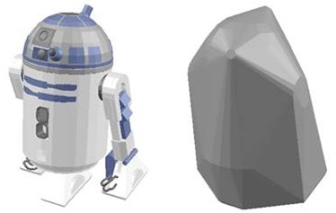

# Опукла оболонка

CoppeliaSim дозволяє обчислювати та додавати опуклу оболонку для зазначених [об'єктів](<Scene objects.md>). Опукла оболонка множини mesh-об'єктів визначається як мінімальна опукла поверхня, що оточує усі об'єкти цієї множини. Опукла оболонка може бути обчислена лише для [об'єктів, здатних до вимірювання](<Measurable objects.md>).

Для додавання опуклої оболонки оберіть об'єкти, які повинні бути охоплені, та оберіть пункт меню `Add > Convex hull` або `Add > Inflated convex hull...`. Ви також можете перетворити форму у її опуклу оболонку за допомогою `Edit > Morph into convex shape(s)`.

В залежності від ситуації опуклі оболонки можуть суттєво зменшити обчислювальний час при [розрахунку відстані](https://www.coppeliarobotics.com/helpFiles/en/distanceCalculation.htm) чи симуляції з використанням [сенсору наближення](https://www.coppeliarobotics.com/helpFiles/en/proximitySensors.htm). [Виявлення зіткнень](https://www.coppeliarobotics.com/helpFiles/en/collisionDetection.htm) також будет працювати швидше, якщо замість складної [форми](https://www.coppeliarobotics.com/helpFiles/en/shapes.htm) використовувати її грубішу апроксимацію (тобто опуклу оболонку). Як варіант, можна обчислити опуклу оболонку від [моделі](<../../Scenes and models/Models.md>) (наприклад, робота), зробити її невидимою та використовувати її в усіх розрахунках (виявлення зіткнень, обчислення відстаней і т.д.) замість складної моделі.

[Зліва - модель робота, зібрана з окремих об'єктів, справа - спрощене подання у вигляді опуклої оболонки]

Також варто переглянути розділ про [побудову опуклого розбиття форм](https://www.coppeliarobotics.com/helpFiles/en/convexDecomposition.htm).
