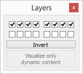

# Вікно вибору шарів

Діалогове вікно вибору шарів - це зручний спосіб сховати або відобразити деякі частини [сцени](<../../Scenes and models/Scenes.md>). Кожний [об'єкт сцени](<Scene objects.md>) може бути розміщений на одному чи кількох шарах з 16 доступних (дивіться [загальні властивості об'єктів](<Properties/Object common properties.md>)). У цьому вікні ви можете активувати або деактивувати будь-який шар. Якщо є необхідність сховати деякі об'єкти, їх можна розмістити на неактивних шарах (обравши, наприклад, [поточний шар + 8]). При збереженні сцени завжди намагайтесь не змінювати початковий стан розподілу шарів (перші 8 активовані, останні 8 деактивовані). Причина у тому, що при копіюванні та переносі [моделі](<../../Scenes and models/Models.md>) з однієї сцени на іншу деякі об'єкти, що повинні були бути невидимими, раптово стануть видимими. Під час симуляції діалогове вікно дає можливість відображати лише динамічне наповнення сцени (**Visualize only dynamic content**), що часто корисно для дебагінгу.

Вікно вибору шарів можна відкрити з меню `Tools > Layers` або натисканням на наступну кнопку на панелі інструментів:

[Кнопка, що відкриває вікно вибору шарів]

[Вікно вибору шарів. Початковий стан (шари 1-8 активні, 9-16 – ні)]

