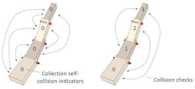

# Загальні властивості об'єктів

Вкладка загальних властивостей об'єкта є складовою [діалогового вікна властивостей об'єкта сцени](index.md), яке розташоване у меню `Tools > Scene object properties`. Те ж саме вікно відкривається подвійним натисканням на іконку об'єкта на [ієрархії сцени](<../../User_Interface/User_Interface.md>) або натисканням на наступну кнопку на [панелі інструментів](<../../User_Interface/User_Interface.md>):

[Кнопка властивостей об'єкта на панелі інструментів]

У цьому вікні кнопка **Common** відкриває вкладку загальних властивостей об'єкта. Вона відображає налаштування і параметри [об'єкта](<../Scene objects.md>), що був обраний останнім. Якщо жодний об'єкт не обраний, елементи будуть не активними. Якщо кілька об'єктів були обрані, тоді за допомогою кнопки **Apply to selection** (_застосувати до усіх_) деякі параметри можуть бути скопійовані з останнього обраного об'єкта до інших обраних об'єктів:

[Вікно загальних властивостей об'єктів]

- **Selectable** (_доступний до обирання_): зазначає, чи може об'єкт бути обраний, або виділений, на сцені. Об'єкти завжди можуть бути виділені на [ієрархії сцени](<../../User_Interface/User_Interface.md>). Також варто ознайомитись з функцією [`sim.setObjectProperty`](https://www.coppeliarobotics.com/helpFiles/en/regularApi/simSetObjectProperty.htm).
- **Invisible during selection** (_невидимий під час обирання_): коли увімкнено, об'єкт буде непомітним для процесу обирання (тобто ви зможете обирать _наскрізь_ об'єкта).
- **Ignored by depth pass** (_ігнорується під час проходу глибини_): коли увімкнено, об'єкт не буде братися до уваги під час проходу рендерингу глибини. Прохід глибини потрібен задля коректного розташування червоної кулі під час рухів камери.
- **Select base of model instead** (_обирати базу моделі замість цього об'єкта_): коли увімкнено, під час виділення об'єкта на сцені замість нього буде обиратися його найближчий предок, що відмічений як **об'єкт-база для моделі**. Ця властивість буде корисною, коли потрібно захистити модель від помилкових маніпуляцій та забезпечити, щоб усі дії над кількома різними об'єктами виконувались синхронно. Ознайомтесь з [розділом про моделі](<../../../Scenes and models/Models.md>) та функцією [`sim.setObjectProperty`](https://www.coppeliarobotics.com/helpFiles/en/regularApi/simSetObjectProperty.htm).
- **Ignored by model bounding box** (_ігнорується обмежувальною рамкою моделі_): коли увімкнено, та коли об'єкт є складовою [моделі](<../../../Scenes and models/Models.md>), тоді обмежувальна рамка моделі (видима під час виділення) не буде охоплювати цей об'єкт. Це корисно для невидимих об'єктів, які можуть "розтягнути" обмежувальну рамку моделі. Це налаштування не має функціонального ефекту. Також варто ознайомитись з функцією [`sim.setObjectProperty`](https://www.coppeliarobotics.com/helpFiles/en/regularApi/simSetObjectProperty.htm).
- **Ignored for view-fitting** (_ігнорується під час коректування на виду_): об'єкти з цим увімкненим параметром не беруться до уваги під час процесу коректування розміщення сцени на виду, коли жодний об'єкт не обраний. Зазвичай воно увімкнено для поверхонь та схожих об'єктів. Також варто ознайомитись з [кнопкою коректування виду на панелі інструментів](<../../User_Interface/User_Interface.md>) та API функцією [`sim.cameraFitToView`](https://www.coppeliarobotics.com/helpFiles/en/regularApi/simCameraFitToView.htm).
- **Cannot be deleted during simul.** (_не може бути видалений під час симуляції_): коли увімкнено, об'єкт буде ігнорувати операцію видалення під час прогону симуляції (однак він все одно може бути видалений з використанням програмного коду).
- **Cannot be deleted** (_не може бути видалений_): коли увімкнено, об'єкт буде ігнорувати операцію видалення (однак він все одно може бути видалений з використанням програмного коду).
- **Hidden during simulation** (_прихований під час симуляції_): коли увімкнено, об'єкт буде прихований під час прогону симуляції.
- **Not moveable** (_нерухомий_): коли увімкнено, об'єкт не може бути посунутий за допомогою миші.
- **Extension string** (_рядок розширень_): рядок, у якому зазначаються додаткові параметри об'єкта. Головним чином потрібен для плагінів (дивіться також API функцію [`sim.getExtensionString`](https://www.coppeliarobotics.com/helpFiles/en/regularApi/simGetExtensionString.htm).
- **Camera visibility layers** (_шари видимості камери_): кожний об'єкт у CoppeliaSim може бути розташований на одному чи кількох шарах видимості. Якщо обраний хоч б один шар, що збігається з обраними у [вікні вибору шарів](<../Layer selection dialog.md>), об'єкт буде видимим під час погляду з камери. Типовим налаштуванням для новостворених об'єктів типу ["форма"](https://www.coppeliarobotics.com/helpFiles/en/shapes.htm) є розміщенням на першому шарі, для типу ["з'єднання"](https://www.coppeliarobotics.com/helpFiles/en/joints.htm) - на другому, для типу ["макет"](https://www.coppeliarobotics.com/helpFiles/en/dummies.htm) - на третьому і т.д.
- **Object is model base** (_об'єкт-база для моделі_): відображає, чи повинен об'єкт виконувати роль бази [моделі](<../../../Scenes and models/Models.md>). Об'єкт з цим флагом має деякі особливості (як, наприклад, копіювання об'єкта скопіює усю ієрархію під ним). На додачу до цього, коли такий об'єкт виділяється, обмежувальна рамка малюється як товста пунктирна лінія, що охоплює усю модель. Цей параметр пов'язаний з одним з попередніх, а саме **Select base of model instead**. Окрім цього, модель буде мати однаковий ідентифікатор з усіма копіями та клонами. Модель може переносити свою ДНК (тобто свої налаштування) до усіх своїх клонів за допомогою [кнопки](<../../User_Interface/User_Interface.md>) переносу ДНК. Уявіть, що на сцені розташовані 100 однакових роботів, і ви хочете змінити їх однаковим чином: для цього треба змінити лише один, виділити його та застосувати операцію переносу ДНК.

[Кнопка переносу ДНК на панелі інструментів]

- **Edit model properties** (_редагувати властивості моделі_): відкриває [діалогове вікно налаштувань моделі](<../../../Scenes and models/Models/Model dialog.md>).
- **Collidable** (_здатний до стикання_): дозволяє обраному об'єкту, який взагалі [здатний до зіткнень](<../Collidable objects.md>), брати участь у процесі [виявлення зіткнень](https://www.coppeliarobotics.com/helpFiles/en/collisionDetection.htm).
- **Measurable** (_здатний до вимірювання_): дозволяє обраному об'єкту, який взагалі [здатний до вимірювань](<../Measurable objects.md>), брати участь у [обчисленні мінімальної відстані](https://www.coppeliarobotics.com/helpFiles/en/distanceCalculation.htm).
- **Detectable** (_здатний до виявлення_): дозволяє обраному об'єкту, який взагалі [може бути виявлений](<../Detectable objects.md>), бути "побаченим" [сенсорами наближення](https://www.coppeliarobotics.com/helpFiles/en/proximitySensors.htm).
- **Collection self-collision indicator** (_індикатор зіткнень всередині колекції_): коли відбувається виявлення зіткнень або обчислення мінімальної відстані між двома **тотожними** колекціями, CoppeliaSim співставляє усі елементи - складові цієї колекції з усіма іншими. В деяких ситуаціях (наприклад, з кінематичним ланцюгом) перевіряти послідовні зв'язки не бажано, адже вони можуть постійно стикатися на інтефейсі. У цьому випадку треба задати індикатор зіткнень всередині колекції: два елементи всередині колекції не будуть співставлятися, якщо різниця між їх індикаторами дорівнює рівно 1, 10, 100, 1000, 10000 або 100000. Це зображено на наступному малюнку:

[Індикатори зіткнень всередині колекції]

