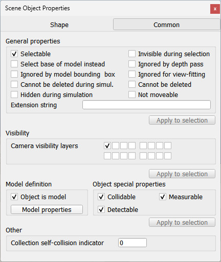

# Загальні властивості об'єктів

Вкладка загальних властивостей об'єкта є складовою [діалогового вікна властивостей об'єкта сцени](index.md), яке розташоване у меню `Tools > Scene object properties`. Те ж саме вікно відкривається подвійним натисканням на іконку об'єкта на [ієрархії сцени](<../../User_Interface/User_Interface.md>) або натисканням на наступну кнопку на [панелі інструментів](<../../User_Interface/User_Interface.md>):

[Кнопка властивостей об'єкта на панелі інструментів]

У цьому вікні кнопка **Common** відкриває вкладку загальних властивостей об'єкта. Вона відображає налаштування і параметри [об'єкта](<../Scene objects.md>), що був обраний останнім. Якщо жодний об'єкт не обраний, елементи будуть не активними. Якщо кілька об'єктів були обрані, тоді за допомогою кнопки **Apply to selection** (_застосувати до усіх_) деякі параметри можуть бути скопійовані з останнього обраного об'єкта до інших обраних об'єктів:

[Вікно загальних властивостей об'єктів]

- **Selectable** (_доступний до обирання_): зазначає, чи може об'єкт бути обраний, або виділений, на сцені. Об'єкти завжди можуть бути виділені на [ієрархії сцени](<../../User_Interface/User_Interface.md>). Також варто ознайомитись з функцією [`sim.setObjectProperty`](https://www.coppeliarobotics.com/helpFiles/en/regularApi/simSetObjectProperty.htm).
- **Invisible during selection** (_непомітний під час обирання_): коли увімкнено, об'єкт буде невидимим для процесу обирання (тобто ви зможете обирать _наскрізь_ об'єкта).
