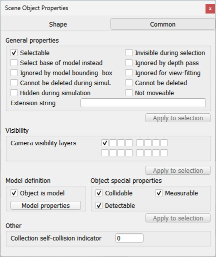

# Властивості об'єктів сцени

Властивості [об'єктів сцени](<../Scene objects.md>) розташовані у меню `Tools > Scene object properties`. Те ж саме діалогове вікно відкривається подвійним натисканням на іконку об'єкта на [ієрархії сцени](<../../User_Interface/User_Interface.md>) або натисканням на наступну кнопку на [панелі інструментів](<../../User_Interface/User_Interface.md>):

[Кнопка властивостей об'єкта на панелі інструментів]

На діалоговому вікні властивостей відображаються налаштування [об'єктів сцени](<../Scene objects.md>). Наповнення цього вікна змінюється відповідно від контексту, а саме від поточного вибору об'єктів на сцені — будуть висвітлені властивості того об'єкта, що був виділений останнім. Ці властивості поділяються на два типи:

- Властивості притаманні даному типу об'єктів: специфічні налаштування для типу обраного об'єкта. Деталі далі на цій сторінці.
- [Загальні властивості об'єктів](<Object common properties.md>): налаштування притаманні усім типам.

Дві кнопки у верхній частині вікна дозволяють перемикатися між цими двома типами властивостей. Якщо жодний об'єкт не обраний, усі елементи у вікні будуть не активними.

[Діалогове вікно властивостей, що наразі демонструє загальні властивості об'єктів]

Частина вікна, що відображає специфічні властивості деякого типу об'єктів, буде мати один із виглядів, наведених нижче (в залежності від об'єкта, що був обраний останнім):

- [Налаштування камери](https://www.coppeliarobotics.com/helpFiles/en/cameraPropertiesDialog.htm)
- [Налаштування освітлення](https://www.coppeliarobotics.com/helpFiles/en/lightPropertiesDialog.htm)
- [Налаштування форми](https://www.coppeliarobotics.com/helpFiles/en/shapeProperties.htm)
- [Налаштування з'єднання](https://www.coppeliarobotics.com/helpFiles/en/jointProperties.htm)
- [Налаштування макета](https://www.coppeliarobotics.com/helpFiles/en/dummyPropertiesDialog.htm)
- [Налаштування графіка](https://www.coppeliarobotics.com/helpFiles/en/graphPropertiesDialog.htm)
- [Налаштування сенсора наближення](https://www.coppeliarobotics.com/helpFiles/en/proximitySensorPropertiesDialog.htm)
- [Налаштування сенсора бачення](https://www.coppeliarobotics.com/helpFiles/en/visionSensorPropertiesDialog.htm)
- [Налаштування сенсора сили](https://www.coppeliarobotics.com/helpFiles/en/forceSensorPropertiesDialog.htm)
