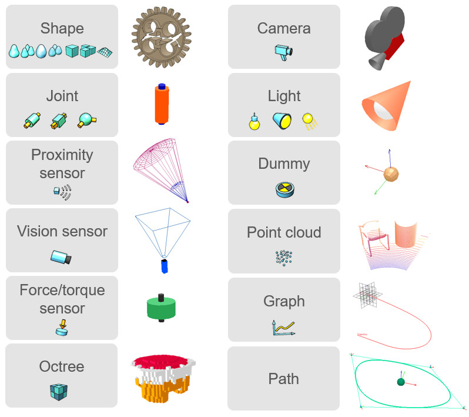
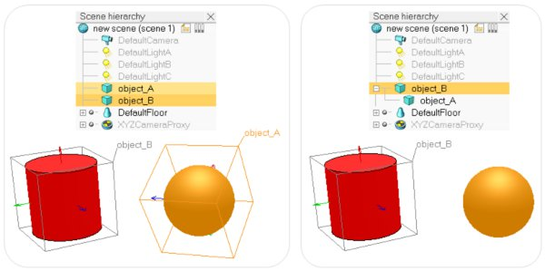

# Об'єкти сцени

Об'єкти сцени є головними елементами CoppeliaSim, які використовуються для створення [сцени симуляції](<../../Scenes and models/Scenes.md>). Об'єкти можна побачити на [ієрархії сцени](<../../User_Interface/User_Interface.md>) та на [виду](<../../User_Interface/Pages and views.md>) сцени. На виду сцени об'єкти різних типів мають тривимірні представлення, які зображені на наступному малюнку:

[Типи об'єктів CoppeliaSim та їх тривимірне представлення]

Далі наведений стислий функціональний опис кожного типу:

- [Форми](https://www.coppeliarobotics.com/helpFiles/en/shapes.htm) (_shapes_): форма – це жорстка mesh-мережа, що складається з трикутних граней.
- [З'єднання](https://www.coppeliarobotics.com/helpFiles/en/joints.htm) (_joints_): з'єднання – це стиковий елемент або виконавчий механізм (актуатор). З'єднання бувають обертальними, призматичними, ґвинтовими або сферичними.
- [Графіки](https://www.coppeliarobotics.com/helpFiles/en/graphs.htm) (_graphs_): графіки використовуються для записування та візуалізації даних про симуляцію.
- [Макети](https://www.coppeliarobotics.com/helpFiles/en/dummies.htm) (_dummies_): макет – це точка з направленням. Це універсальні об'єкти з багатьма потенційними застосуваннями.
- [Сенсори наближення](https://www.coppeliarobotics.com/helpFiles/en/proximitySensors.htm) (_proximity sensors_): ці датчики виявляють об'єкти, що геометрично відповідають їх визначеній зоні виявлення. CoppeliaSim пропонує такі форми сенсора - піраміда, циліндр, диск, конус та промінь.
- [Сенсори бачення](https://www.coppeliarobotics.com/helpFiles/en/visionSensors.htm) (_vision sensors_): цей датчик функціонально схожий на камеру та здатен реагувати на світло, колір та зображення.
- [Сенсори сили](https://www.coppeliarobotics.com/helpFiles/en/forceSensors.htm) (_force sensors_): датчик сили здатен вимірювати силу та обертальний момент сили. Він також має можливість _ламатися_ при досягненні деякого межового значення.
- [Камери](https://www.coppeliarobotics.com/helpFiles/en/cameras.htm) (_cameras_): камера – це об'єкт, який дозволяє _бачити_ сцену симуляції з різних точок зору.
- [Освітлення](https://www.coppeliarobotics.com/helpFiles/en/lights.htm) (_lights_): об'єкт освітлення допомагає підсвічувати сцену симуляції.
- [Октодерева](https://www.coppeliarobotics.com/helpFiles/en/octrees.htm) (_OC trees_): октодерево – це структура даних, що створена розбиттям тривимірного простору на вокселі.
- [Хмари точок](https://www.coppeliarobotics.com/helpFiles/en/pointClouds.htm) (_point clouds_): хмара точок – це структура, схожа на октодерево, яке складається з точок.
- [Шляхи](https://www.coppeliarobotics.com/helpFiles/en/paths.htm) (_paths_): шлях – це направлена у просторі послідовність точок. Він вважається _псевдооб'єктом сцени_, бо складається виключно з макетів та [скрипта налаштування](https://www.coppeliarobotics.com/helpFiles/en/customizationScripts.htm), який описує його функціональність та поведінку.

Деякі з вищенаведених об'єктів можуть мати просторові властивості, що дозволять іншим об'єктам або [функціоналу](https://www.coppeliarobotics.com/helpFiles/en/functionality.htm) взаємодіяти з ними. Об'єкти можуть бути здатними до:

- [Стикання](<Collidable objects.md>): такі об'єкти можуть брати участь у [виявленні зіткнень](https://www.coppeliarobotics.com/helpFiles/en/collisionDetection.htm) з іншими подібними об'єктами.
- [Вимірювання](<Measurable objects.md>): такі об'єкти можуть бути використані для [обчислення мінімальної відстані](https://www.coppeliarobotics.com/helpFiles/en/distanceCalculation.htm) з другими об'єктами, що вимірюються.
- [Виявлення](<Detectable objects.md>): їх можуть виявляти [сенсори наближення](https://www.coppeliarobotics.com/helpFiles/en/proximitySensors.htm).
- [Переглядів](<Viewable objects.md>): подібні об'єкти можна програмно _бачити_ або _бачити наскрізь_, до того ж їх зображення можуть бути візуалізовані на видах. Детальна інформації надана у [розділі про сторінки та види](<../../User_Interface/Pages and views.md>).

На сцені симуляції кожний об'єкт має свою позицію та направлення, які разом називаються конфігурацією об'єкта. Об'єкти можуть приєднуватись один до одного (або створюватись на базі інших). Якщо об'єкт А створений на базі об'єкта Б, тоді об'єкт Б вважається батьком, а об'єкт А - нащадком. Для створення батьківских взаємин між об'єктами А та Б, оберіть спочатку об'єкт А, а потім об'єкт Б (порядок важливий). Далі оберіть меню [Edit > Set parent, keep pose(s)]. Ця операція зображена нижче:

[(1) Перед доєднанням об'єкта А до об'єкта Б, (2) після доєднання об'єкта А до об'єкта Б]

Для виконання тієї ж операції можна зробити drag-and-drop одного об'єкта на інший на [ієрархії сцени](<../../User_Interface/User_Interface.md>). Варто відмітити, що конфігурація об'єкта А не змінилась (обидва об'єкта зберегли свою початкову конфігурацію). Однак на ієрархії сцени помітно, що об'єкт А став нащадком об'єкта Б. Якщо ви посунете об'єкт Б, об'єкт А буде рухатись разом з ним, бо тепер він доєднаний до об'єкта Б. Для від'єднання об'єкта А оберіть опцію меню [Edit > Set parent-less]. При цьому конфігурація об'єкта А знов не зміниться. Від'єднання також можна виконати операцією drag-and-drop іконки об'єкта на іконку сцени.

Кожний об'єкт має абсолютну, або кумулятивну, конфігурацію, яка визначає розташування об'єкта у контексті глобальної системи відліку, та локальна, або відносна, конфігурація, яка рахується відносно системи відліку батьківського об'єкта. У попердньому прикладі, коли об'єкт А став нащадком об'єкта Б, його абсолютна конфігурація не змінилась, на відміну від локальної.

Абсолютна конфігурація об'єкта, що був виділений останнім, відображається у рядку [інформаційного тексту](<../../User_Interface/User_Interface.md>). Зміни абсолютної чи локальної конфігурації об'єкта можливо робити через [вікно координат та трансформацій](<../../User_Interface/Position/orientation manipulation.md>) або за допомогою [безпосередньої маніпуляції мишею](<../../User_Interface/Object_movement_with_the_mouse.md>).
