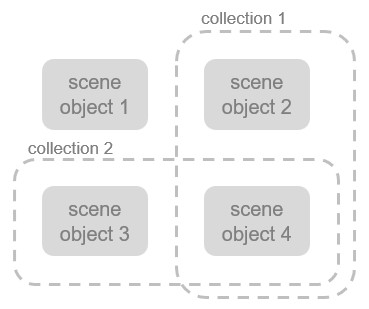

# Сутності

Сутність (entity) - це термін, яким позначається [об'єкт сцени](<Scene objects/Scene objects.md>) або [колекція](Collections.md). Наступна картинка демонструє відношення між об'єктами сцени (scene objects), колекціями (collections) та сутностями:

[Сутності - об'єкти сцени та колекції]

