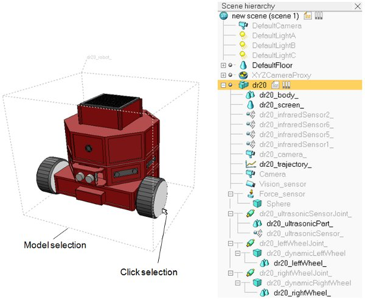
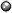
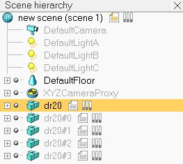

# Моделі

Модель це піделемент [сцени](Scenes.md). Модель не може існувати сама по собі (окрім як у файлі типу `*.ttm`). Для участі у будь-яких симуляціях вона повинна бути додана на сцену.

Визначенням моделі є набір [об'єктів сцени](https://www.coppeliarobotics.com/helpFiles/en/objects.htm), що розташовані в межах однієї ієрархії, де верхівка дерева повинна бути об'єктом, позначеним як _"об'єкт-база для моделі"_. Моделі можуть бути завантажені через [File > Load model...]. Однак набагато легше і зручніше додавати їх drag-and-drop операцією з [браузера моделей](<../User_Interface/User_Interface.md>) на [вид сцени](<../User_Interface/Pages and views.md>). Моделі можуть бути збережені через [File > Save model as...], але треба переконатися, що вибрана лише один об'єкт позначений як _"об'єкт-база для моделі"_ - інакше цей пункт не буде активний. Також радимо ознайомитись з [посібником зі створення чистої моделі](../Tutorials/Building_a_clean_model_tutorial.md).

Модель визначається наступним чином:
- помістіть усі об'єкти, які логічно належать до моделі, у дерево, верхівкою якого буде базовий об'єкт для цієї моделі.
- поставте флаг _"об'єкт-база для моделі"_ у [загальних властивостях об'єкта](https://www.coppeliarobotics.com/helpFiles/en/commonPropertiesDialog.htm).
- у тому ж діалоговому вікні клікніть на _"Змінити властивості моделі"_. Тут ви можете задати деякі спільні властивості (наприклад, зробити усю модель невидимою або такою, що не зіштовхується) для усіх об'єктів, що належать до даної моделі.
- для усіх об'єктів у моделі, окрім базового, поставте флаг _"Обирати базу моделі замість цього об'єкта"_ у [загальних властивостях об'єкта](https://www.coppeliarobotics.com/helpFiles/en/commonPropertiesDialog.htm). Це захистить вашу модель: ви не зможете безпосередньо обирати окремі складові моделі, натомість зможете маніпулювати нею майже як цільним об'єктом.
- для усіх об'єктів, які зазвичай не видимі, поставте флаг на _"Не виділяти всередині моделі при виборі"_. Завдяки цьому обмежувальна рамка буде коректно відмальована навколо моделі.
- подумайте о ролі цієї моделі: чи буде вона прикріплятися до іншого об'єкта (наприклад, коли ваша модель це захоплювач, що прикріпляється до зап'ястя маніпулятора)? Або чи потрібно вам буде прикріпляти якусь іншу модель до неї (наприклад, коли ваша модель це маніпулятор, якому потрібен захоплювач)? Коли роль з'ясована, визначте [формат збірки](https://www.coppeliarobotics.com/helpFiles/en/commonPropertiesDialog.htm#assembling) моделі. Також продивіться [поради щодо дизайну динаміки](https://www.coppeliarobotics.com/helpFiles/en/designingDynamicSimulations.htm#modelBaseSelection).

Тепер окремі об'єкти - складові бази моделі - не можуть бути виділені окремо при виборі їх на сцені (замість цього обиратись буде база моделі). Однак вони все ще можуть бути виділені як самостійні шляхом притримування клавіш `Ctrl` та `Shift` або при натисканні на них на [ієрархії сцени](<../User_Interface/User_Interface.md>). На додачу, коли виділяється база моделі, з'являється пунктирна обмежувальна рамка, що охоплює усю модель, як на наступному фото:

[Вигляд сцени та її ієрархія. Виділений макет позначений як <i>"об'єкт-база для моделі"</i>]

Зверніть увагу на мітку зліва від іконки модельної бази:

[Мітка моделі]

Подвійне натискання на мітку відкриває [діалогове вікно](<Models/Model dialog.md>), де змінюються налаштування моделі. Корисною звичкою буде згортати дерево моделі після редагування: це дозволить легше визначати кількість логічно згрупованих елементів / моделей.

[Ієрархія сцени з 5 згорнутими моделями]

Групування кількох об'єктів у моделі також важливо, коли [дочірній скрипт](https://www.coppeliarobotics.com/helpFiles/en/childScripts.htm) має посилання на деякі об'єкти. Пам'ятайте, що в CoppeliaSim об'єкти чи моделі можна копіювати у будь-який час, навіть під час симуляції. Для того, щоб зкопійований дочірній скрипт посилався на правильний об'єкт (тобто на такий же зкопійований об'єкт, а не на оригінальний), дочірній скрипт завжди повинен копіюватись разом з об'єктами, на які він посилається. Щоб це гарантувати можна створити модель (за визначеним раніше алгоритмом) та переконатися, що дочірні скрипти з посиланням на об'єкти асоційовані з об'єктами у тій самій моделі. Найкраще буде асоціювати один з дочірніх скриптів (адже їх може бути багато) з базою моделі. Більше інформації надано у [довіднику з доступу до об'єктів сцени](https://www.coppeliarobotics.com/helpFiles/en/accessingSceneObjects.htm).

Для того, щоб різні моделі можна було комбінувати (тобто будувати поверх одна одної) без зайвих модифікацій, важливо визначити, яку роль буде грати та чи інша модель - чи буде вона симульована в динаміці? Чи буде вона під'єднануватись до інших моделей або інші до неї? Відповіді на ці питання дозволять обрати найкращий тип об'єкта для бази моделі. Більше інформації надано у [довіднику з розробки симуляції динаміки](https://www.coppeliarobotics.com/helpFiles/en/designingDynamicSimulations.htm#modelBaseSelection).

Копіювання моделі працює так само, як послідовне її збереження та завантаження (однак з використанням буферу пам'яті замість диску). Моделі можуть копіюватися з однієї сцени на іншу як будь-які інші об'єкти. Файли моделі (`*.ttm`-файли) також підтримують drag-and-drop операції між вікном провідника та вікном застосунку. На файли моделі також можна натистнути двічі, у випадку чого вони запустять програму CoppeliaSim та будуть завантажені на початкову сцену.

Налаштування моделі можуть бути змінені у відповідному [діалоговому вікні](<Models/Model dialog.md>).
