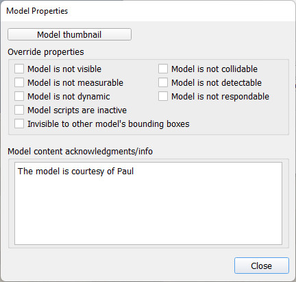

# Налаштування моделі

Властивості моделі можуть бути змінені у відповідному діалоговому вікні. Щоб його відкрити, натисніть двічі на іконку моделі на [ієрархії сцени](<../../User_Interface/User_Interface.md>):

[Іконка моделі на ієрархії cцени]

[Діалогове вікно]

- **Мініатюра моделі**: при збереженні моделі спливає вікно, у якому до моделі можна додати мініатюру, яка буде видима у [браузері моделі](<../../User_Interface/User_Interface.md>). Але якщо вам потрібно зберегти мініатюру вашої моделі у іншій конфігурації (наприклад, ви хочете зберегти модель робота-змії у витягнутому стані, але хочете мініатюру у вигляді зігнутої змії), тоді її можна додати тут.
- **Спільні властивості**: тут ви можете відключити, або перевизначити, деякі властивості для усіх об'єктів, що складають дерево моделі. Це зручно, якщо потрібно швидко відключити модель, яка, до прикладу, витрачає дуже багато обчислювального часу. Також варто ознайомитись із [об'єкатми, що зіштовхуються](<../../Entities/Scene objects/Collidable objects.md>), [об'єкатми, що вимірюються](<../../Entities/Scene objects/Measurable objects.md>), [об'єктами, що детектуються](<../../Entities/Scene objects/Detectable objects.md>) та API функцією [`sim.SetModelProperty()`](https://www.coppeliarobotics.com/helpFiles/en/regularApi/simSetModelProperty.htm).
- **Посилання на авторів моделі / інфо**: будь-яка інформація о моделі. Гарною звичкою буде завжди згадувати розробників оригінальної моделі або імпортованої mesh-мережі. Модель з наявними посиланнями чи додатковою інформацією буде показувати їх, коли вона відкрита.
